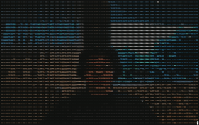

 

  <h3 align="center">chat-a-tui</h3>
  

      A Video Chat Application that Runs in the Terminal.
  

    

<!-- ABOUT THE PROJECT -->
## About

This is a passion project developed in order to learn more about state of the art streaming protocols like QUIC and AES-GSM (in Rust of course). 

(<a href="#readme-top">back to top</a>)

## Features
- [x] Render video feed (e.g. screen capture) onto the terminal.
- [x] Stream feed across a secure channel (using TLS certificates). 

## Built With

These are some of the tools used to build this project.

* `tokio`, the asynchronous runtime.
* `s2c-quic` for streaming data securely over the QUIC protocol.

(<a href="#readme-top">back to top</a>)

